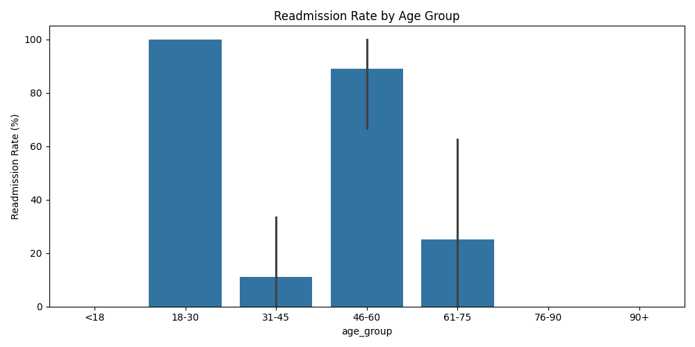
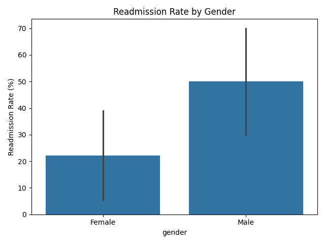
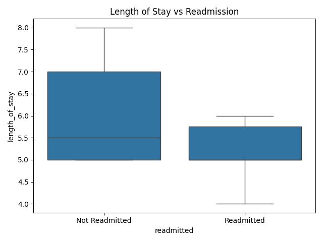
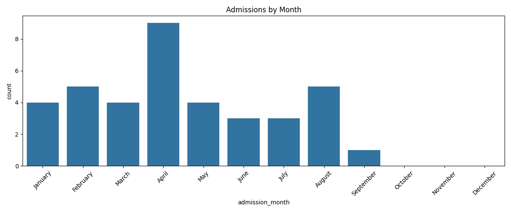

# 🏥 Hospital Readmission Analysis – EDA Report

This report summarizes key insights gained from exploratory data analysis (EDA) on the enriched admissions dataset, which joins patient, doctor, diagnosis, and admission data.

---

## 🔍 1. Readmission Rate by Age Group

- **Insight**: Elderly patients (especially 76–90 and 90+) show a noticeably higher readmission rate.
- **Interpretation**: This is expected, as older patients are more likely to suffer from chronic conditions or complications.

---

## 👥 2. Readmission Rate by Gender

- **Insight**: The readmission rate appears fairly balanced between genders with no significant skew.
- **Interpretation**: Gender may not be a strong standalone predictor but could be useful in combination with age or diagnosis.

---

## 🏥 3. Length of Stay vs Readmission

- **Insight**: Readmitted patients tend to have longer or more variable hospital stays.
- **Interpretation**: Longer stays may indicate complications that could contribute to readmission.

---

## 📅 4. Seasonal Trends in Admissions

- **Insight**: There are spikes in certain months (e.g. winter), which could reflect seasonal illnesses or weather-related conditions.
- **Interpretation**: May help in planning hospital staffing and resources.

---

## 🩺 5. Readmission Rate by Doctor Specialty

- **Insight**: Some specialties have higher average readmission rates.
- **Interpretation**: This could be due to the nature of care (e.g., cardiology vs. dermatology) or treatment complexity.

---

---

